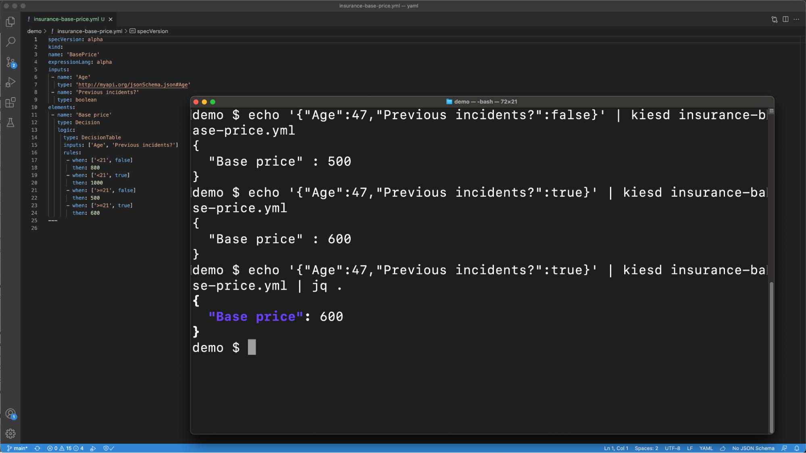
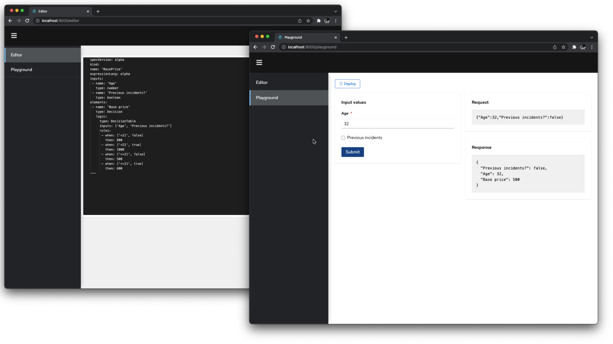
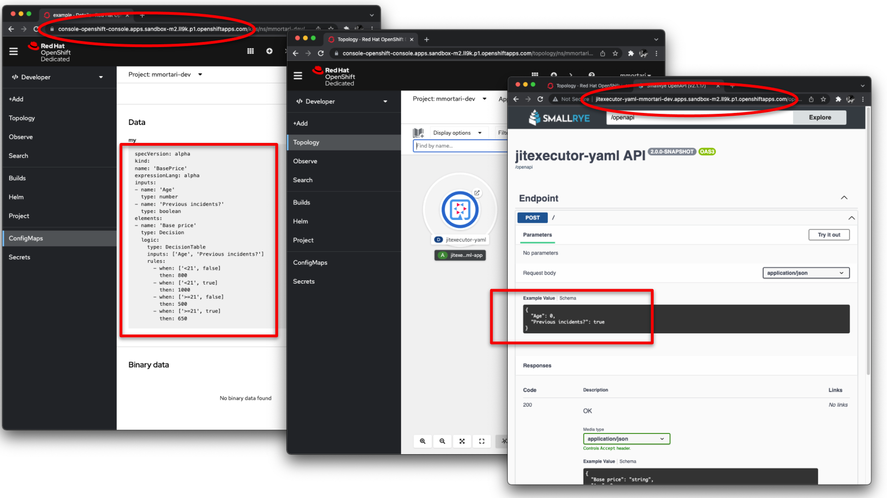
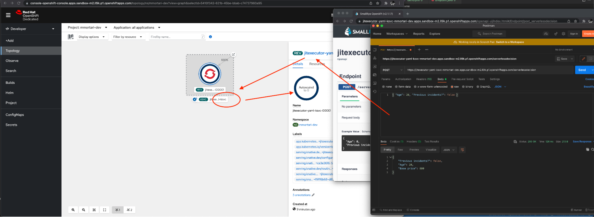
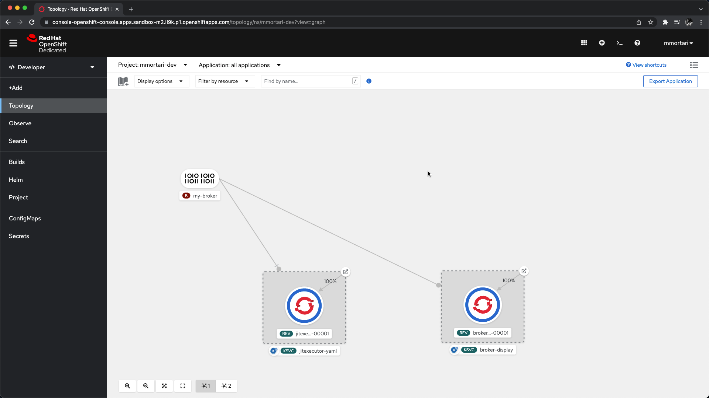

**YaRD - Yet another Rule Definition**

A simple way to describe declarative *Decisions* and *Rules* in YAML.

This exploration effort proposes a simple YAML notation to describe Decisions, Rules, and Declarative Logic in general.

YaRD is designed from the ground-up to be usable standalone, or in a cloud-native based solution.<br/>
YaRD is also designed to be usable standalone in a Knative solution, and/or alongside the standard CNCF Serverless Workflow potentially to complement the logic required before a Switch, or required to be evaluated before another State, and/or to complement potentially any Managed Service, any Knative service equivalently.
<p align="center">

<br />
(videos coming soon)
</p>

This is currently a research effort, to explore this space. Not a supported capability.<br/>
If you find this content interesting and you would like to contribute, feel free to contact us and reach out!

# Simple example

To introduce the idea of YaRD, let's consider a basic example where we want to decide what is the **Base price** of a service, given a couple of inputs, accordingly to the following decision table:

|  Age   | Previous incidents?   | Base price   |
|:------:|:---------------------:|:------------:|
| ` <21` |        `false`        |    ` 800`    |
| ` <21` |        ` true`        |    `1000`    |
| `>=21` |        `false`        |    ` 500`    |
| `>=21` |        ` true`        |    ` 600`    |

The above decision table could be easily represented with a simple YAML as follows:

```yaml
specVersion: alpha
kind: YaRD
name: 'MyDecision'
…
elements:
- name: 'Base price'
  type: Decision
  logic:
    type: DecisionTable
    inputs: ['Age', 'Previous incidents?']
    rules:
     - ['<21' , false,  800]
     - ['<21' ,  true, 1000]
     - ['>=21', false,  500]
     - ['>=21',  true,  600]
```

This YaRD, which can be thought of as a pure function `base_price(Age, Previous_Incidents_bool)` , could be invoked via CloudEvents on Ingress+Sink on a Knative environment. We will see that in more detail with more complete example cases below. 

## Executing locally

As an executable example, one could think of this YaRD capability to be accessible on the command line too, in this case focusing directly on the content of the CloudEvent’s Data payload coming as input (eg: Knative Source) and reflected as CloudEvent’s Data payload for output (eg: Knative Sink).

For the scope of a simple demo, below using a provisionally defined alias `kiesd` as a command line utility, showing how the input JSON is handled into the YaRD engine, the decision logic of the decision table executed, and how this is reflected in the output JSON. 



## Development and Testing

As an example of developing with the YaRD capability, a small application is presented which allows to edit the definition file, and quickly play with it using a guided forms (instead of the command line utility):



## Deployment

Below is presented a working example of deployment: based on the YAML content of the YaRD definition, a REST service can be provided automatically on K8s. For the purpose of this demo, the working use-case is presented on top of the [Developer Sandbox for Red Hat OpenShift](https://developers.redhat.com/developer-sandbox):



Similarly we can think having this as a capability in Knative Service; that makes it autoscale-to-zero when not in operations, here the  depicted a few times after having invoked the service:



Similarly we can also think having this capability as part of an Event Mesh architecture comprising a Knative Broker, to consume CloudEvent and produce new events with the results of the YaRD:



In the next sections, we will describe some of the capabilities offered by YaRD.

# Key Elements

This section discusses some of the concepts which we want to be represented in this YaRD format, along with some provisional design and definitions. You can skip to the next sections for an overview of more complete examples.

## An extensible YAML markup for Decision and Rules

Providing support for multiple types of Decision and Rules.

Providing support of user-preferred expression language.

Example:
```yaml
specVersion: alpha
kind: YaRD
name: 'Traffic Violation'
expressionLang: alpha
…
elements:
- name: 'Fine'
  type: Decision
  logic:
    type: DecisionTable
    inputs: ['Violation.type', 'Violation.Actual Speed - Violation.Speed Limit']
    rules:
     - ['="speed"', '[10..30)', {'Amount': 500, 'Points': 3}]
     …
- name: 'Should the driver be suspended?'
  type: Decision
  logic:
    type: LiteralExpression
    expression: 'if Driver.Points + Fine.Points >= 20 then "Yes" else "No"'
```

## Plug-in mechanism for multiple expression languages

The expression language can be selected by the end-User / Modeler, as the YaRD provides a plug-in mechanism for it (see extensibility point above).

Same base price example, but using `JQ` expression language also used by CNCF:
```yaml
specVersion: alpha
kind: YaRD
name: 'BasePrice'
expressionLang: 'jq'
inputs:
- name: 'Age'
 type: 'http://myapi.org/jsonSchema.json#Age'
- name: 'Previous incidents?'
 type: boolean
elements:
- name: 'Base price'
 type: Decision
 logic:
   type: DecisionTable
   inputs: ['.Age', '."Previous incidents?"']
   rules:
   - when: [. < 21, . == false]
     then: 800
   - when: [. < 21, . == true]
     then: 1000
   - when: [. >= 21, . == false]
     then: 500
   - when: [. >= 21, . == true]
     then: 600
```

## Described in YAML, but compatible with JSON too

This document adopts YAML as the preferred serialization.

However, we will strive not to use any YAML-specific feature which might compromise having an equivalent serialization in JSON too.
<!--(ref old comment).-->

## Explicitly stateless

A specific section describes the input parameters; the decision logic and rules have its own dedicated section. This allows the user to clearly express the logic intent.

Example:
```yaml
…
inputs:
- name: 'Driver'
  type: 'http://myapi.org/jsonSchema.json#Driver'
- name: 'Violation'
  type: 'http://myapi.org/jsonSchema.json#Violation'
elements:
- name: 'Fine'
  type: Decision
  …
- name: 'Should the driver be suspended?'
  type: Decision
  logic:
  …
```

## Support for Decision Tables
Decision tables are a very common and important type of logic, as they naturally capture complex Rules, which otherwise would be described with a very messy nesting of if/else. 

Currently under discussion the canonical form.

### Candidate decision table form A example:
Example:
```yaml
elements:
- name: 'Base price'
  type: Decision
  logic:
    type: DecisionTable
    inputs: ['Age', 'Previous incidents?']
    rules:
     - ['<21', false, 800]
     - ['<21', true, 1000]
     - ['>=21', false, 500]
     - ['>=21', true, 600]
```

### Candidate decision table form B example:

Example:
```yaml
elements:
- name: 'Base price'
  type: Decision
  logic:
    type: DecisionTable
    inputs: ['Age', 'Previous incidents?']
    rules:
     - when: ['<21', false]
       then: 800
     - when: ['<21', true]
       then: 1000
     - when: ['>=21', false]
       then: 500
     - when: ['>=21', true]
       then: 600
```

## Potential layering of rules in this format
Decision table and Expression are naturally not the only type of declarative logic which is potentially a good use-case for this format; this section describes traditional rules in a layered approach, that borrow inspiration of rules expressed in yaml by other initiatives, but in a generalized manner.

The actual form for the rules is open for discussion.

Example:
```yaml
specVersion: alpha
kind: YaRD
name: 'Using moc Rules with Decisions'
expressionLang: alpha
inputs:
 - name: 'Driver'
   type: 'http://myapi.org/jsonSchema.json#Driver'
 - name: 'Violation'
   type: 'http://myapi.org/jsonSchema.json#Violation'
elements:
 - name: 'Fine'
   type: Decision
   logic:
     type: DecisionTable
     inputs: ['Violation.type', 'Violation.Actual Speed - Violation.Speed Limit']
     rules:
     - ['="speed"', '[10..30)', {'Amount': 500, 'Points': 3}]
     - ['="speed"', '>= 30', {'Amount': 1000, 'Points': 7}]
     - ['="parking"', '-', {'Amount': 100, 'Points': 1}]
     - ['="driving under the influence"', '-', {'Amount': 1000, 'Points': 5}]
 - name: 'Should the driver be sanctioned?'
   type: moc Rules
   schemas: http://myapi.org/jsonSchema.json
   host_rules:
     - name: R1
       condition:
         all:
         - $f: /Fine[ Points > 0 ]
         - $d: /Driver
       action:
         assert_fact:
           sum of points: $f.Points + $d.Points
           total due: $f.Amount
     - name: R2
       condition: /Balance[ sum of points > 20 ]
       action:
         send_event: 'Suspend driver'
     - name: R3
       condition: /Balance[ total due >= 1000 ]
       action:
         send_event: 'Issue money collection priority slip'
```

# FAQ

**Q: Why YAML?**<br/>
A: We believe it is a pragmatic, current-day approach to express declaratively logic (such as rules, decision, workflows, etc) but not only limited to that! With reference to the most common examples out there, the way YAML is used in K8s, YAML is used to declaratively describe some desired “state” of the infrastructure or system. So we are providing examples in YAML as that is a natural and pragmatic fit for YaRD.
Also, [from earlier in this doc] we will strive not to use any YAML-specific feature which might compromise having an equivalent serialization in JSON too.
<!-- (ref old comment). -->
We’re also open to other formats, provided rationale and +1s.

**Q: What type of semantics are supported?**<br/>
A: At this stage we’re mainly focusing on (simple) Decision Tables and generalized Literal Expressions; from experience in the *decision automation* space, those are the most common, basic, easy-to-understand types of decision logic needed to support the majority of simple use-cases.
We’re of course open to consider other types of declarative decision/rule formalisms as we progress!

**Q: Which Expression Language is supported?**<br/>
A: We’re striving to provide open-support to any expression language (EL) that supports predicate logic and structural-type or plays well with JSON-like structures in general. That’s why we are focusing on the semantics of the Decision Tables and Literal Expressions type of decision logic.
At the time of writing this faq-entry (2022-02-22), the expression language is marked “alpha” as we’re using some provisional one to bootstrap the (code-)infrastructure needed. We’re currently considering both FEEL, an open-standard expression language which proved simple to pick up in the *decision automation* space, **and** the [JQ](https://stedolan.github.io/jq/) expression language, a de-facto standard very popular in the CNCF community(ies), as *first-class* support, but this is NOT decided yet and is open to discussion and +1s. We’re open to consider onboarding and dropping as needed/requested.
Important considerations in the area of support-able ELs are *also*: ease of use in writing the rules/decisions, license, ease of integration with JVM platform, etc.
We might consider providing first-class support to selected expression languages, as we progress on this specification.
Early experiments show for instance JavaScript (precisely tested with both V6 as supported by JEP 292, *and*  ECMAScript 2021) fit these points nicely, and could likely be a supported EL but also directly as a “first-class support”! We have also conducted early experiments with other *surprising* ELs too, such as [PowerFX](https://github.com/microsoft/Power-Fx)! The results motivate us to investigate further into this plug-in architecture.

**Q: I couldn’t find my question here?**<br/>
A: Don’t hesitate to leave a comment, write us an email or drop in chat!
